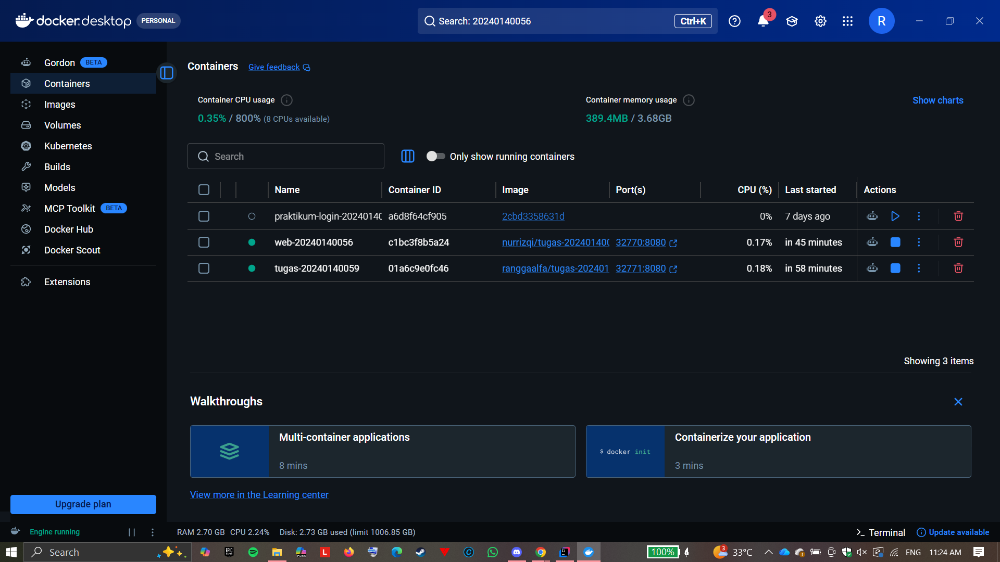
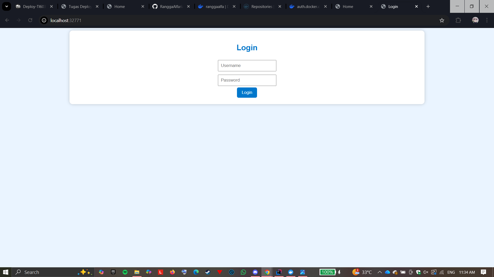
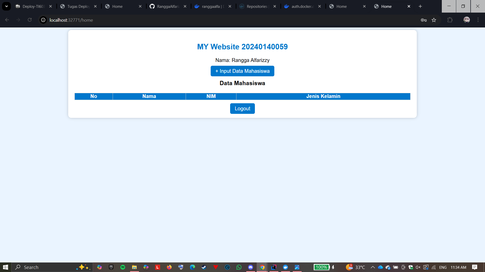
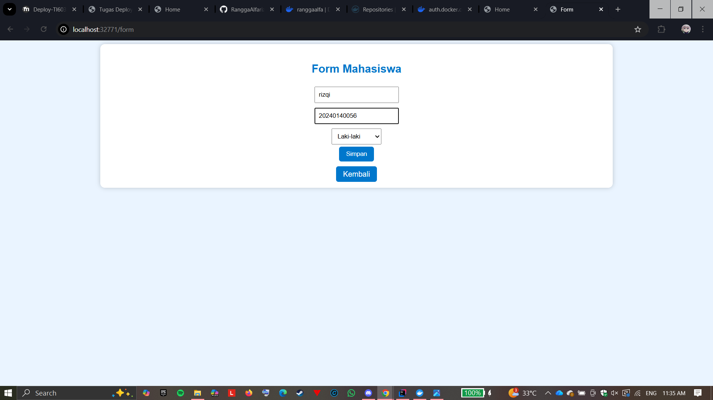
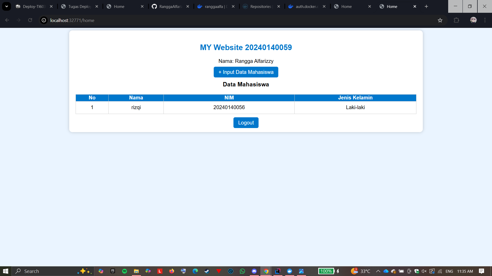

# 📦 Tugas Deploy Docker - 20240140059

## 🐳 1. Docker Images
Berikut adalah tampilan Docker Images setelah:
- Push image project sendiri
- Pull image dari teman

---

## 🐳 2. Docker Containers
Berikut tampilan container setelah menjalankan:
- Container project sendiri
- Container dari image teman

)

---

## 🌐 3. Web Aplikasi (Dijalankan dari Docker)

### 🔐 Halaman Login

---

### 🏠 Halaman Home

---

### 📝 Halaman Form

---

### 📊 Home Setelah Input Data

---

## 👥 4. Web Teman (Hasil Pull Image)

### 🔐 Halaman Login

---

### 🏠 Halaman Home

---

### 📝 Halaman Form

---

### 📊 Home Setelah Input Data

---

## ✅ Keterangan
- Aplikasi dijalankan menggunakan Docker
- Data bersifat sementara (tidak menggunakan database)
- Login:
  - Username: **admin**
  - Password: **20240140059**
